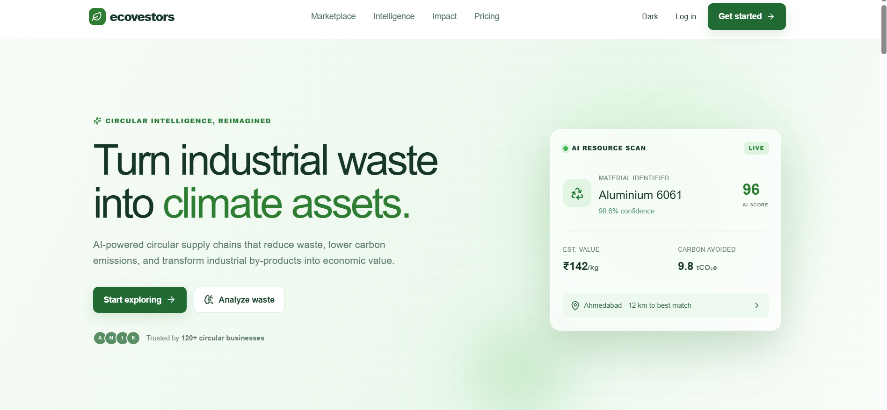
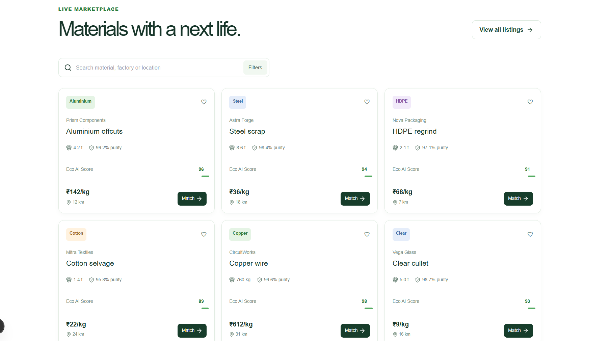
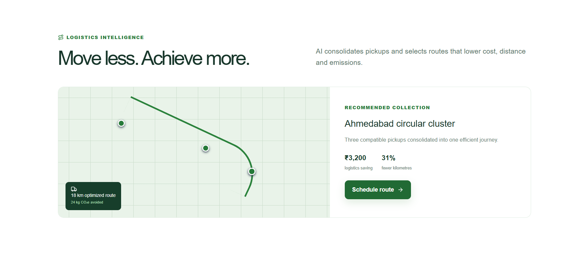
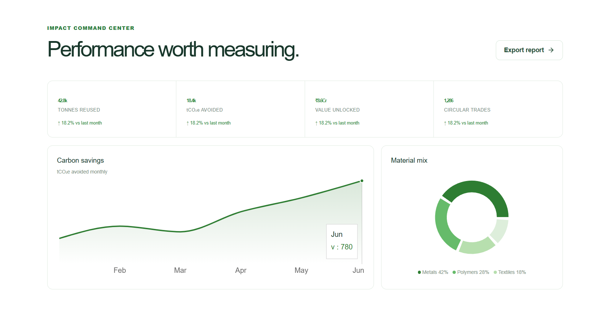
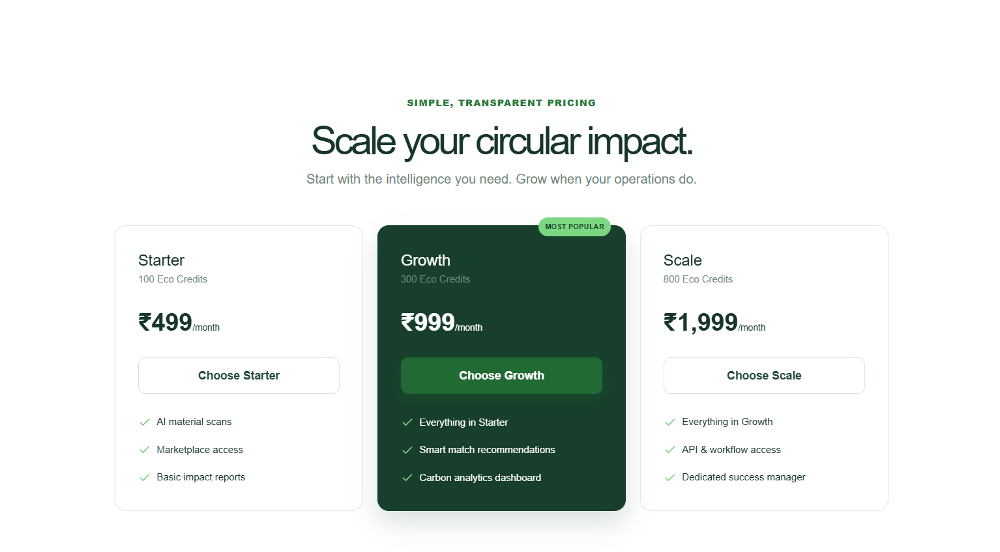

<div align="center">

<h1>EcoVestors AI</h1>

<h3>AI-Powered Circular Resource Intelligence Platform</h3>

<p>
Transforming industrial waste into valuable resources through intelligent matching, optimized logistics, and sustainability analytics.
</p>

</div>

---

<b>Overview</b>

EcoVestors AI is an AI-powered climate technology platform designed to accelerate the transition towards a circular economy. The platform enables industries to transform reusable industrial waste into valuable resources by intelligently connecting manufacturers with artisans, recyclers, and MSMEs.

Using Artificial Intelligence, EcoVestors AI identifies reusable materials, recommends suitable buyers, optimizes transportation, and quantifies environmental impact through real-time carbon and ESG analytics. By reducing landfill dependency and promoting material reuse, the platform creates measurable economic and environmental value.

---

<b>Application Preview</b>

<b>Landing Page</b>

<p align="center">

</p>

A modern landing experience introducing EcoVestors AI and its vision of building intelligent circular supply chains.

---

<b>AI Marketplace</b>

<p align="center">

</p>

An AI-powered marketplace where industries list reusable materials while the platform recommends optimal buyers based on material compatibility, proximity, logistics efficiency, and sustainability impact.

---

<b>Logistics Intelligence</b>

<p align="center">

</p>

The logistics optimization module recommends efficient collection routes that reduce transportation costs, travel distance, and carbon emissions.

---

<b>Sustainability Dashboard</b>

<p align="center">

</p>

A centralized analytics dashboard providing insights into material recovery, carbon emissions avoided, circular transactions, and environmental performance.

---

<b>Subscription Plans</b>

<p align="center">

</p>

Flexible Eco Credit subscription plans designed to help organizations scale circular resource management efficiently.

---

<b>Key Features</b>

- AI-powered industrial waste identification and classification
- Circular Intelligence Engine for intelligent buyer recommendations
- Digital Material Passport for material traceability
- AI-driven logistics optimization
- Carbon impact calculator and sustainability analytics
- ESG reporting dashboard
- Circular marketplace connecting industries, recyclers, artisans, and MSMEs
- Eco Credit subscription management

---

<b>Technology Stack</b>

| Category | Technologies |
|----------|--------------|
| Frontend | Next.js 15, React 19, TypeScript |
| Styling | Tailwind CSS, Framer Motion |
| UI Components | shadcn/ui, Lucide Icons |
| Charts | Recharts |
| Forms | React Hook Form, Zod |
| Maps | Leaflet |
| Deployment | GitHub & Vercel Compatible |

---

<b>Installation</b>

Clone the repository and install the required dependencies.

```bash
npm install
npm run dev
```

Open the application at:

```text
http://localhost:3000
```

---

<b>Sustainability Impact</b>

EcoVestors AI enables organizations to:

- Reduce industrial waste sent to landfills
- Lower greenhouse gas emissions
- Convert waste disposal costs into revenue opportunities
- Improve access to affordable secondary raw materials
- Support ESG and sustainability reporting
- Promote circular resource utilization

---

<b>Future Roadmap</b>

- AI-powered Computer Vision for waste recognition
- Predictive material demand forecasting
- Blockchain-enabled Digital Material Passport
- IoT-based smart waste monitoring
- ERP and enterprise integrations
- Carbon Credit Marketplace
- Real-time logistics tracking
- Automated ESG compliance reporting

---

<b>Vision</b>

EcoVestors AI aims to become the digital infrastructure for industrial circularity by enabling organizations to transform waste into measurable environmental and economic value.

Through intelligent resource matching, optimized logistics, and AI-driven sustainability analytics, the platform supports industries in building resilient, efficient, and low-carbon supply chains.

---

<b>License</b>

This project is released under the MIT License.
